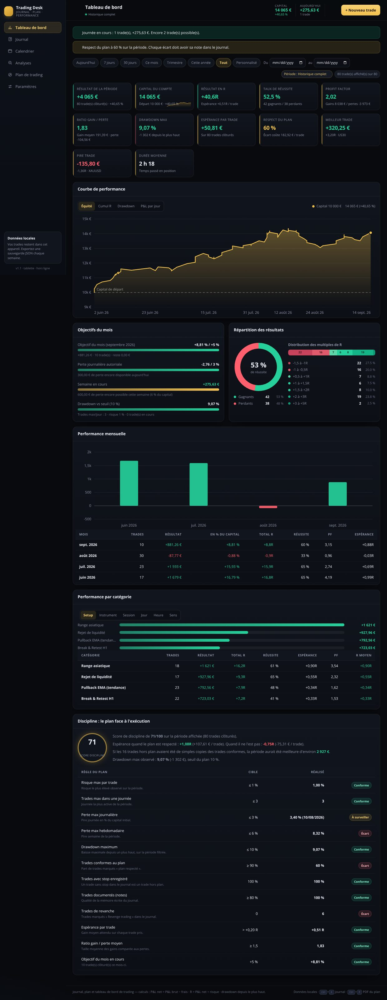

# Journal & Plan de trading — Tableau de bord de performance

Application **locale, sans dépendance** (HTML + CSS + JavaScript vanilla) pour :

1. **écrire un plan de trading** et le garder sous les yeux (règles de risque, setups, routine, KPI, checklists) ;
2. **tenir un journal** de chaque trade (chiffres, capture, émotion, erreur, respect du plan) ;
3. **voir ses performances** : courbe d'équité, drawdown, P&L par jour/mois/setup/instrument/session, distribution des R, calendrier annuel, score de discipline.

Cible : compte **forex & indices CFD** (EURUSD, XAUUSD, US30, NAS100…), style intraday / swing court, résultats suivis **en R et en devise**.

**Utilisable sur ordinateur et sur tablette** : application installable (PWA), plein écran, fonctionne **hors ligne** et adaptée au tactile (voir la section [Sur tablette](#sur-tablette-ipad--android)).



*Aperçus : `apercu-tablette.jpg` (journal en cartes sur iPad), `apercu-installation.jpg` (bandeau d'installation), `apercu-plan.jpg` (plan complet), `apercu-calendrier.jpg`.*

---

## Démarrer

L'application est 100 % statique : aucune installation n'est nécessaire.

| Méthode | Comment |
|---|---|
| **Le plus simple** | Double-cliquez sur `index.html` (fonctionne en `file://`, les données restent dans le navigateur). |
| **Sans double-clic** | `node tools/serve.js` puis ouvrez <http://localhost:8777/> |
| **Depuis le repo** | `npx serve trading` ou tout autre serveur statique. |
| **Sur tablette, via le Wi-Fi** | `node tools/serve.js` puis scanner le QR code affiché (voir § Sur tablette). |
| **Sur tablette, en application** | Publier en HTTPS (GitHub Pages, ou l'archive `trading-site.zip` sur Netlify Drop) puis l'ajouter à l'écran d'accueil. |

À la racine du dépôt, `index.html` redirige automatiquement vers `trading/` : une fois le site publié (GitHub Pages par exemple), l'adresse racine ouvre directement l'application.

Au premier lancement, le journal est vide. Trois boutons sont proposés : **Ajouter un trade**, **Importer un CSV**, **Charger la démo** (80 trades fictifs pour voir le tableau de bord en action — supprimables depuis *Paramètres*).

---

## Accès rapide depuis la tablette


Scannez le QR code de l'image ci-dessus (`ouvrir-sur-tablette.png`) avec l'appareil
photo de la tablette : le navigateur ouvre <https://moussantji.github.io/excel/>.
Ajoutez ensuite l'application à l'écran d'accueil (*Partager → Sur l'écran
d'accueil* sur iPad, *⋮ → Installer l'application* sur Android).

## Sur tablette (iPad / Android)

Trois façons de l'utiliser sur la tablette, de la plus rapide à la plus complète.

### Voie A — Tout de suite, en Wi-Fi local (aucun compte, rien à installer)

```bash
node tools/serve.js
```

Le terminal affiche l'adresse à ouvrir sur la tablette **et un QR code à scanner** avec l'appareil photo :

```
   Sur cet ordinateur  :  http://localhost:8777/
   Sur la tablette     :  http://192.168.1.42:8777/   (même réseau Wi-Fi)
   [QR code à scanner]
```

L'application fonctionne entièrement (saisie, statistiques, graphiques, export JSON), mais en `http://` elle n'est **pas installable** et **pas disponible hors ligne** : c'est la limite des navigateurs, qui réservent ces fonctions au HTTPS. Pour aller plus loin, choisissez la voie B ou C.

### Voie B — Application installable via GitHub Pages (recommandé)

Le dépôt est **public**, donc GitHub Pages est disponible gratuitement.

1. **Ouvrir la page** : <https://github.com/moussantji/excel/settings/pages>
2. Section **Build and deployment** → le champ **Source** est un *menu déroulant* : par défaut il n'affiche qu'une valeur (« GitHub Actions » ou « None »). **Cliquez sur ce menu** pour voir les deux choix, puis sélectionnez **Deploy from a branch**.

   ```
   Build and deployment
     Source   [ GitHub Actions  ▾ ]   ← cliquer ici
                ┌──────────────────────────┐
                │ Deploy from a branch   ✓ │
                │ GitHub Actions           │
                └──────────────────────────┘
   ```
3. Un nouveau bloc **Branch** apparaît : choisir la branche `arena/01a09dd0-excel` (pour tester tout de suite) ou `main` (après fusion de la pull request), dossier **/ (root)**, puis **Save**.
4. Après 1 à 3 minutes, l'adresse s'affiche en haut de la page du même nom :

```
https://moussantji.github.io/excel/
```

La racine du site redirige automatiquement vers l'application (`/trading/`), donc c'est cette adresse qu'il faut enregistrer sur la tablette.

#### Si « Source » ou « Deploy from a branch » n'apparaît pas

| Cause probable | Solution |
|---|---|
| Vous consultez GitHub **sur la tablette / le téléphone** : la version mobile masque le menu des réglages | Ouvrir le menu du navigateur → **Version pour ordinateur** (Safari : bouton **aA** → *Demander le site web pour ordinateur* ; Chrome Android : **⋮** → *Site pour ordinateur*), puis rouvrir l'adresse ci-dessus |
| Le menu **Source** affiche seulement « GitHub Actions » | C'est un menu déroulant : cliquez dessus, l'option **Deploy from a branch** s'y trouve |
| Vous êtes sur **Settings** mais pas sur la page **Pages** | Dans le menu de gauche, section **Code and automation** (ou *Sécurité* selon la version), cliquer sur **Pages** — ce n'est pas la même page que *General* |
| La page affiche un écran d'accueil « GitHub Pages » | Cliquer sur **Configure** / **Get started** : le menu **Source** apparaît ensuite |
| Vous n'êtes **pas propriétaire** du dépôt | Seul le propriétaire (ou un administrateur) voit et modifie cette page |
| Un bandeau parle d'un **forfait payant** | Cela arrive quand le dépôt est **privé**. Ici le dépôt `moussantji/excel` est public : ce message ne devrait pas s'afficher. Si c'est le cas, dites-moi le texte exact affiché. |
| Rien de tout cela | Utilisez la **voie C** (5 minutes, sans GitHub) |

### Voie C — Sans GitHub : Netlify Drop ou Cloudflare Pages

Une archive prête à publier est fournie à la racine du dépôt : **`trading-site.zip`** (326 Ko, `index.html` à la racine de l'archive). Elle se régénère à tout moment avec :

```bash
node trading/tools/make-site-zip.js
```

- **Netlify Drop** : ouvrir <https://app.netlify.com/drop>, déposer/choisir `trading-site.zip` → une adresse HTTPS est prête en quelques secondes (compte gratuit pour la conserver).
- **Cloudflare Pages** : *Workers & Pages → Create → Pages → Upload assets*, puis déposer l'archive.
- **Vercel** : *Add New → Project → Import* l'archive ou le dépôt GitHub.

Le résultat est identique à GitHub Pages : HTTPS, installation sur écran d'accueil, fonctionnement hors ligne (l'archive a été testée dans cet état).

### Installation sur la tablette (voies B et C)


| Appareil | Manipulation |
|---|---|
| **iPad / iPhone (Safari)** | Ouvrir l'adresse → bouton **Partager** (carré avec une flèche) → **Sur l'écran d'accueil** → **Ajouter**. |
| **Tablette Android (Chrome)** | Ouvrir l'adresse → menu **⋮** → **Installer l'application** / **Ajouter à l'écran d'accueil**. |
| **Ordinateur (Chrome/Edge)** | Icône d'installation dans la barre d'adresse, ou menu → *Installer*. |

L'application affiche elle-même le mode opératoire : un bandeau en haut d'écran propose l'installation, et un bouton « Installer sur cet appareil » figure en bas de la barre latérale.

### Ce qui est pensé pour la tablette

- **Barre de navigation en bas**, cibles tactiles ≥ 44 px, champs de saisie en 16 px (évite le zoom automatique sur iOS).
- **Journal en cartes** : sur écran étroit, chaque trade devient une carte (instrument, P&L, R, setup, session, risque, pips, frais, durée, badges plan/émotion/erreur) — plus de tableau coupé. Bascule **Tableau / Cartes / Auto** en haut du journal ; en mode *Auto*, l'affichage s'adapte à la largeur de l'écran.
- **Rotation** portrait/paysage prise en charge (mode paysage : barre latérale complète, grille de KPI sur 3 colonnes).
- **Hors ligne** : après une première ouverture avec connexion, le service worker met en cache l'application. Le bandeau d'accueil, l'onglet actif, les checklists et les saisies en cours sont conservés si vous passez à une autre application.
- **Mises à jour** : le code (JS/CSS/HTML) est chargé *réseau d'abord* — une nouvelle version est donc active dès le premier rechargement, y compris sur l'application installée, sans vider le cache à la main.
- **Synchronisation entre onglets** : si le journal est ouvert deux fois (ou sur deux fenêtres), l'affichage se met à jour. Un bouton **⟳** en haut à droite recharge les données enregistrées.

### Données de démonstration

Le bouton **Charger la démo** sert uniquement à découvrir l'application : il installe 80 trades fictifs cohérents. Chaque trade est marqué « démo », ce qui permet de les retirer **sans toucher à vos trades réels**, à trois endroits :

- le bandeau violet en haut du tableau de bord → bouton **Supprimer la démo** ;
- le bouton **Supprimer la démo (n)** dans la barre d'outils du journal ;
- **Paramètres → Données & sauvegarde → Supprimer les trades de démo (n)**.

Un indicateur dans la barre du haut rappelle en permanence **« Mode démonstration — n trades fictifs »** tant qu'il en reste. Dès qu'il n'y a plus aucun trade, le tableau de bord affiche l'écran d'accueil (ajouter un trade, importer un historique, voir la démo) au lieu de graphiques vides.

### Vos données sur tablette

Elles sont stockées **dans le navigateur de la tablette** et, si vous l'activez, **sauvegardées automatiquement dans votre dépôt GitHub privé** (voir *Sauvegarde cloud automatique*). Vous pouvez en plus les **chiffrer avec un code** (voir *Verrouillage et chiffrement*), avec Face ID sur iPad.

- Pour **retrouver le même journal sur l'ordinateur et la tablette** : activez la *Sauvegarde cloud* sur les deux appareils (même dépôt, même fichier) — la fusion se fait par trade. Sinon, *Exporter → Sauvegarde JSON* sur l'un puis *Importer* sur l'autre.
- Un vidage du navigateur, une réinstallation ou une navigation privée effacent le stockage local : avec la sauvegarde cloud, il suffit de reconfigurer le dépôt pour tout retrouver. Sans elle, gardez la **sauvegarde JSON hebdomadaire**.

### Vérifier le rendu sur tablette (développement)

```bash
node tools/serve.js                 # dans un premier terminal
npm i -D puppeteer
node tools/tablet-check.js          # dans un second : contrôle iPad portrait/paysage et Android 10"
```

Le script vérifie l'absence de débordement horizontal, la taille des cibles tactiles, la vue cartes et le rechargement hors ligne.

---

## Ce que contient chaque vue

### 📊 Tableau de bord
- **Garde-fous du jour** : nombre de trades restants, perte journalière encore disponible, alerte rouge dès qu'une limite du plan est atteinte.
- **12 KPI** : résultat, capital, total R, taux de réussite, profit factor, ratio gain/perte, drawdown max, espérance par trade, respect du plan, meilleur/pire trade, durée moyenne.
- **Courbe de performance** avec 4 modes : *Équité*, *Cumul R*, *Drawdown*, *P&L par jour* (survol = détail du trade).
- **Objectifs du mois** : progression vers +5 % (paramétrable), perte journalière, semaine en cours, drawdown vs seuil.
- **Répartition** : donut gagnants/perdants + distribution des multiples de R.
- **Performance mensuelle** : graphique + tableau (résultat, % du capital, total R, réussite, PF, espérance).
- **Performance par catégorie** : setup, instrument, session, jour de semaine, heure, sens.
- **Discipline** : score sur 100 et tableau « règle du plan / cible / réalisé / écart ».

### 📒 Journal
- Tableau triable et filtrable (instrument, setup, session, sens, respect du plan, recherche plein texte, période).
- Formulaire complet avec **calculs automatiques** : pips, R:R prévu, risque estimé, P&L net, multiple de R (aperçu en direct avant enregistrement).
- Dupliquer / supprimer une ligne en un clic, import CSV, export CSV ou sauvegarde JSON.

### 🗓️ Calendrier
- 12 mini-calendriers annuels : chaque jour coté en couleur avec son résultat et son total de R.
- Clic sur un jour → détail des trades de la journée + notes.
- Top 10 des meilleures et des pires journées, résultat par mois.

### 🔍 Analyses
- Indicateurs avancés : SQN, Sharpe par trade, écart-type des R, séries gagnantes/perdantes, frais, risque cumulé, coût du hors-plan.
- **Conformité au plan chiffrée** : espérance des trades « plan respecté » vs « hors plan » — autrement dit, combien coûte chaque écart.
- Classements par setup, session, jour, heure, instrument, émotion, erreur.

### 🧭 Plan de trading — méthode SMV (Smart Money Vision)
Plan rédigé sur la méthode **SMV** : les 4 lois (structure, offre/demande, cause à effet, liquidité), les types de BOS, les phases d'accumulation et de distribution, la lecture de la liquidité (intact, EQH/EQL, inducement, complexe pull back) et les outils (fibo SMC premium/discount, IPA, market shift, décompte 0-1-2-3).
- **4 setups documentés** avec 6 lignes chacun (contexte, déclencheur, entrée, stop, objectifs, invalidation) : Golden Setup (phase C), Complexe Pull Back, Market Shift (ChoCh), ODF.
- Règles de risque chiffrées : **1 % maximum par trade, stop 15 pips maximum, ratio minimum 1:7, 2 stop loss par jour maximum**, mise à breakeven à la cassure, prises partielles 30 % / 50 % / solde.
- Fenêtres de tir : Asie 1h–2h, Europe 8h–9h, USA 13h–14h (heure de Bamako).
- **4 checklists interactives** (pré-trade, gestion de position, post-trade, revue hebdomadaire) dont l'état est sauvegardé.
- **2 contrôles de discipline supplémentaires** dans le suivi : part des trades dont le ratio visé atteint 1:7 et respect du stop à 15 pips maximum.
- Bouton **Imprimer / PDF** avec une feuille de style dédiée (fond clair, lisible sur papier).

### ⚙️ Paramètres
Capital, devise, risque par trade, valeur du pip, limites (jour/semaine/drawdown), objectif mensuel, listes d'instruments, de setups et de sessions ; **sécurité** (verrouillage, chiffrement, code de secours, biométrie, verrouillage automatique) ; **sauvegarde cloud (dépôt GitHub)** : dépôt, branche, fichier, jeton, test de connexion, journal des dernières opérations ; import/export ; effacement des données.

---

## Comment sont calculés les indicateurs

| Indicateur | Formule |
|---|---|
| P&L net | `P&L brut − frais` |
| Multiple R | `P&L net ÷ risque` (risque saisi, ou calculé : `taille × distance au stop ÷ taille du pip × valeur du pip`) |
| Pips | `(sortie − entrée) ÷ taille du pip` (signe selon achat/vente) |
| Taux de réussite | `trades gagnants ÷ trades clôturés` |
| Profit factor | `somme des gains ÷ somme des pertes` (en valeur absolue) |
| Espérance (R) | `moyenne des multiples R` |
| Ratio gain/perte | `gain moyen ÷ perte moyenne` |
| SQN | `√N × espérance ÷ écart-type des R` |
| Drawdown | `équité − plus haut atteint` (en % : relatif au plus haut), calculé depuis le capital de départ |
| Score de discipline | moyenne des 12 règles du plan (conforme = 1, à surveiller = 0,5, écart = 0) |

La **taille du pip** est déduite automatiquement de l'instrument : forex 0,0001 · paires JPY 0,01 · or 0,1 · indices 1 point · crypto 1. La valeur du pip par lot est paramétrable (10 € par défaut).

---

## Importer un CSV / Excel

1. Dans Excel : **Fichier → Enregistrer sous → CSV UTF-8** (ou copiez-collez dans le formulaire d'import).
2. Dans l'application : *Journal → Importer CSV* (ou *Paramètres → Importer*).
3. Le séparateur (`;`, `,`, tabulation) et les décimales (virgule ou point) sont détectés automatiquement, ainsi que les entêtes en français comme en anglais.

Modèles fournis dans `exemples/` :

- `modele-journal.csv` — toutes les colonnes disponibles ;
- `modele-journal-simple.csv` — colonnes minimales (date, instrument, sens, entrée, stop, sortie, taille, risque, frais, plan, émotion, erreur, notes) ;
- `donnees-demo.csv` — les 80 trades de démonstration.

Colonnes reconnues (accents et casse ignorés) : `Date, Heure, Instrument/Symbole/Paire, Sens/Direction, Session, Setup/Stratégie, Entrée, Stop/SL, Objectif/TP, Sortie, Taille/Lots/Volume, Risque, P&L, Frais/Commission, P&L net, R, Respect du plan, Émotion, Erreur, Durée, Notes, Capture`.

> Si la colonne `R` est fournie sans P&L, elle est utilisée telle quelle. Si seul le « P&L net » est fourni, il devient le résultat et les frais passent à 0.

---

## Sauvegarde & vie privée

### 1. Hors ligne, sur l'appareil (`localStorage`)

Les données sont stockées **dans votre navigateur**. L'application fonctionne entièrement hors ligne : réseau coupé, tout continue d'être enregistré.

- *Paramètres → Exporter → Sauvegarde JSON* produit un fichier complet (trades + réglages + cases des checklists) à réimporter ailleurs.
- Videz le cache du navigateur sans sauvegarde = données perdues. Faites la sauvegarde JSON en même temps que la revue hebdomadaire.
- Un export CSV est également disponible (séparateur `;`, virgules décimales : ouvrable directement dans Excel français).

### 2. Verrouillage et chiffrement du journal (optionnel)

*Paramètres → **Sécurité*** : le journal est chiffré avec un code que vous seul connaissez.

- **Ce qui est chiffré** : les trades, les paramètres et les cases des checklists — sur l'appareil **et** dans le fichier du dépôt GitHub. Le fichier du dépôt ne contient plus que du texte chiffré (AES-GCM 256, clé dérivée du code par PBKDF2).
- **Code de secours** : affiché **une seule fois** à l'activation, imprimable (bouton *Imprimer / enregistrer*). Il ouvre le même journal si vous oubliez le code, et permet ensuite d'en choisir un nouveau.
- **Biométrie** : Face ID / empreinte (passkey + dérivation de clé) sur les appareils qui savent le faire — iPadOS 18+, Android, macOS récents. Sur Surface/PC Windows, Windows Hello ne fournit pas encore cette clé : le code est demandé.
- **Verrouillage automatique** réglable (jamais, 5, 15, 30, 60 minutes sans activité), option « rester ouvert tant que l'onglet est ouvert », et bouton *Verrouiller maintenant*.
- **Précautions** : utilisez un code de **6 chiffres minimum** (le chiffrement est solide, un code de 4 chiffres ne l'est pas), et rangez le code de secours ailleurs que sur l'appareil.

> 🔴 **Code oublié + code de secours perdu = journal illisible définitivement.** Personne ne peut le reconstituer (ni l'hébergeur, ni GitHub, ni ce dépôt). Rien n'est effacé pour autant : les données chiffrées restent en place, il faut juste le code pour les ouvrir.
>
> La sauvegarde cloud continue de fonctionner avec le verrouillage : le fichier du dépôt est chiffré, chaque appareil doit saisir le même code pour le lire. Pendant que le journal est verrouillé, **aucune synchronisation n'a lieu** (impossible d'écraser la sauvegarde avec un journal vide par erreur).
>
> Le chiffrement demande une adresse **https** (l'adresse GitHub Pages de l'application). Ouvert depuis un fichier local en `http://`, le navigateur refuse de chiffrer : l'application le dit et propose la sauvegarde cloud ou l'export JSON.

### 3. Sauvegarde cloud automatique (votre dépôt GitHub)

*Paramètres → **Sauvegarde cloud (GitHub)*** : l'application écrit vos données dans **un fichier de votre dépôt GitHub**. Gratuit, sans service tiers, sans abonnement. Dès qu'une donnée change, la sauvegarde part toute seule (45 secondes après la dernière modification, et au retour du réseau).

Ce qui est sauvegardé : **tous les trades réels**, les paramètres du compte et de risque, et les **cases cochées des checklists**. Les trades de démonstration ne partent pas dans le dépôt.

| Champ | Valeur conseillée |
|---|---|
| Propriétaire | votre compte GitHub (ex. `moussantji`) |
| Dépôt | un dépôt **privé dédié** (ex. `journal-trading`) |
| Branche | `main` |
| Fichier | `journal-trading/sauvegarde.json` (créé automatiquement) |
| Jeton | jeton *fine-grained*, permission **Contents : Read and write** |

#### Créer le jeton (2 minutes)

1. GitHub → **Settings → Developer settings → Personal access tokens → Fine-grained tokens → Generate new token**.
2. **Repository access** : *Only select repositories* → votre dépôt de sauvegarde.
3. **Permissions → Repository permissions → Contents** : **Read and write**.
4. **Expiration** : 90 jours (à recréer ensuite). Générez, copiez, collez dans le champ *Jeton d'accès*.
5. Cliquez **Tester la connexion**, puis **Activer la sauvegarde automatique**.

> **Le jeton reste dans ce navigateur** (stockage local de l'appareil) et n'est **jamais** écrit dans le dépôt ni dans le code. Un dépôt **privé dédié** est fortement conseillé : dans un dépôt public, votre journal serait lisible par tout le monde (l'application vous le signale).

#### Les états de la sauvegarde (affichés en clair dans l'application)

| État | Ce que ça veut dire | Ce que fait l'application |
|---|---|---|
| Sauvegarde cloud désactivée | Aucun dépôt configuré | Rien, tout reste local |
| Journal verrouillé — sauvegarde en pause | Le verrouillage est actif et le code n'a pas été saisi | N'envoie ni ne récupère rien (protection contre l'écrasement) |
| Configuré, aucune sauvegarde envoyée | Premier envoi pas encore fait | Envoie à la première modification |
| Hors ligne — modifications en attente | Réseau coupé (ou avion) | Garde tout en local, repart au retour du réseau |
| *n* modification(s) à sauvegarder | Envoi différé en cours | Envoie après 45 s |
| Synchronisation en cours… | Appel en cours vers GitHub | Attend la réponse (15 s maximum) |
| **À jour** | Sauvegarde à jour | Indique la date du dernier envoi |
| Sauvegarde disponible dans le cloud | Un autre appareil a une sauvegarde plus récente et le journal local est vide | Propose de la **récupérer** (jamais sans votre accord) |
| Conflit : le cloud a été modifié ailleurs | Deux appareils ont modifié le journal | Propose **Fusionner les deux** / Garder mes données / Prendre le cloud |
| Clé refusée | Jeton expiré, révoqué, ou sans droit sur le dépôt | Explique quoi vérifier (Contents : Read and write) |
| Quota GitHub atteint | Trop de requêtes | Réessaie plus tard, rien n'est perdu |
| GitHub injoignable | Panne ou réseau | Réessaie, données locales intactes |
| Échec de la sauvegarde | Autre erreur, renvoyée telle quelle | Affiche le message exact |

Un **bandeau** apparaît dans l'application uniquement quand une action est attendue (hors ligne, conflit, jeton refusé…), avec les boutons utiles. Le reste du temps, une **pastille** discrète dans la barre du haut suffit.

#### Plusieurs appareils

Tablette + ordinateur : chaque appareil garde son journal et **fusionne par trade** — les modifications les plus récentes gagnent, les suppressions sont conservées (un trade supprimé sur la tablette ne revient pas de l'ordinateur). En cas de doute, « Fusionner les deux » est toujours proposé.

#### Mise en place rapide du dépôt

```bash
# sur GitHub : New repository → nom « journal-trading » → Private → Create
# rien à uploader : le premier envoi crée le fichier de sauvegarde tout seul
```

---

## Personnaliser le plan

Le contenu du plan (textes, setups, checklists, seuils) est dans `assets/js/plan.js`, objet `PLAN`. Les règles chiffrées du tableau de bord (limites de risque, instruments, setups, sessions, devise, valeur du pip) se modifient directement dans *Paramètres*.

Règle de bon sens proposée dans le plan lui-même : **une modification du plan par mois maximum, jamais après une perte**, et seulement après 20 trades sur un setup.

---

## Structure du projet

```
trading/
├── index.html                    Application (point d'entrée)
├── manifest.webmanifest          Application installable : nom, icônes, raccourcis
├── sw.js                         Service worker : cache hors ligne
├── assets/
│   ├── icons/                    Icônes (192/512/maskable/Apple/iOS)
│   ├── css/styles.css            Thème sombre / or, responsive, impression, ergonomie tactile
│   └── js/
│       ├── store.js              État, persistance, trade normalisé, CSV, démo
│       ├── metrics.js            Statistiques, agrégats, drawdown, objectifs, garde-fous
│       ├── charts.js             Graphiques SVG sans dépendance (ligne, barres, donut, calendrier)
│       ├── plan.js               Contenu du plan + contrôles de discipline
│       ├── ui.js                 Formatage FR, modales, toasts, icônes SVG
│       ├── views.js              Vues Calendrier, Analyses, Plan, Paramètres
│       ├── sync.js               Sauvegarde cloud GitHub (états, conflits, fusion, hors ligne)
│       ├── lock.js               Verrouillage, chiffrement AES-GCM, code de secours, biométrie
│       ├── app.js                Navigation, tableau de bord, journal, formulaire, import/export
│       └── pwa.js                Installation, hors ligne, synchronisation entre onglets
├── exemples/                     Modèles CSV, jeu de démonstration, modèle de workflow Pages
└── tools/
    ├── serve.js                  Serveur local + QR code pour la tablette (node tools/serve.js)
    ├── make-site-zip.js          Archive prête à publier (trading-site.zip)
    ├── smoke-test.js             Contrôle automatique de tous les écrans (jsdom)
    ├── sync-test.js              Recette de la sauvegarde cloud : états, conflits, fusion (jsdom)
    ├── lock-test.js              Recette du verrouillage : chiffrement, code, secours, biométrie (jsdom)
    ├── tablet-check.js           Contrôle du rendu tablette + mode hors ligne (puppeteer)
    └── vendor/qrcode.js          Générateur de QR code (MIT, Kazuhiko Arase)
```

À la racine du dépôt : `index.html` (redirection vers l'application), `.nojekyll` (nécessaire pour GitHub Pages) et `trading-site.zip` (archive publiée).

Le déploiement HTTPS (GitHub Pages) est décrit dans `exemples/deploiement/` (modèle de workflow) et dans la section « Sur tablette ».

## Outils de développement (optionnels)

```bash
node tools/serve.js                                    # serveur local + QR code pour la tablette
node trading/tools/make-site-zip.js                     # régénérer l'archive de publication
npm i -D jsdom && node tools/smoke-test.js              # chaque vue se rend sans erreur JS
npm i -D jsdom && node tools/sync-test.js                # sauvegarde cloud : états, conflits, fusion
npm i -D jsdom && node tools/lock-test.js                # verrouillage : chiffrement, code, secours, biométrie
npm i -D puppeteer && node tools/tablet-check.js        # rendu tablette + mode hors ligne
node tools/smoke-test.js                                # (test complet : import CSV, PWA, cartes…)
```

Le test de fumée charge la démo, parcourt les 6 vues, les 4 modes de courbe, les 6 regroupements, ouvre le formulaire, enregistre un trade, coche une checklist, modifie les paramètres et vérifie l'aller-retour CSV — et échoue si une erreur JavaScript apparaît.

## Journal des correctifs notables

| Version | Correction |
|---|---|
| 2.2 | **Journal chiffré et verrouillé (optionnel)** : code de déverrouillage, chiffrement AES-GCM 256 avec clé dérivée par PBKDF2, **code de secours imprimable** et **biométrie Face ID / empreinte** (passkey + PRF) quand l'appareil le permet. Le fichier du dépôt GitHub devient illisible lui aussi. |
| 2.2 | **Sécurité dans les Paramètres** : activation en trois étapes expliquées, jauge de force du code, changement de code, nouveau code de secours, désactivation, verrouillage automatique réglable, bouton *Verrouiller maintenant*. |
| 2.2 | **Aucune écriture pendant le verrouillage** : ni sauvegarde locale, ni envoi vers le dépôt, ni récupération — impossible d'écraser la sauvegarde avec un journal vide (état *Journal verrouillé — sauvegarde en pause*). |
| 2.2 | **Défenses contre la devinette** : ralentissement progressif après 5 essais (5 s, 15 s, 60 s, 5 min), chiffrement refusé sur les codes trop courts, avertissements explicites sur les codes de 4 chiffres. |
| 2.1 | **Sauvegarde cloud automatique dans votre dépôt GitHub** : envoi différé (45 s), reprise au retour du réseau, récupération sur un nouvel appareil, **fusion par trade** entre la tablette et l'ordinateur, suppressions conservées. Gratuit, aucun service tiers. |
| 2.1 | **États de la sauvegarde affichés en clair** : hors ligne, en attente, à jour, conflit, clé refusée, quota, GitHub injoignable, échec — pastille dans la barre du haut et bandeau avec les boutons utiles (*Réessayer*, *Fusionner les deux*, *Récupérer la sauvegarde*). |
| 2.1 | **Configuration dans les Paramètres** : dépôt, branche, fichier, jeton (fine-grained, *Contents : Read and write*), bouton *Tester la connexion*, journal des dernières opérations. Le jeton reste dans le navigateur de l'appareil. |
| 2.0 | **Plan réécrit sur la méthode SMV** (Smart Money Vision) : les 4 lois, la structure (HH/HL, LH/LL, consolidation, 3 types de BOS), l'offre et la demande (OB/POI, order flow, breaker bloc), la cause à effet (phases A à E, accumulation et distribution) et la liquidité (intact, EQH/EQL, trendline, signature, inducement, complexe pull back). |
| 2.0 | **4 setups SMV** documentés en 6 lignes : Golden Setup (prise de position en phase C), Complexe Pull Back, Market Shift (prise de liquidité + ChoCh), ODF (entrée ratée). |
| 2.0 | **Règles de risque SMV** : 1 % maximum par trade, stop 15 pips maximum, ratio minimum 1:7, 2 stop loss par jour maximum, breakeven à la cassure, prises partielles 30 / 50 / solde. Deux contrôles de discipline suivent ces règles automatiquement (part des trades à 1:7 ou plus, respect du stop à 15 pips). |
| 2.0 | **Journal au vocabulaire SMV** : setups, sessions (Asie / Europe / USA avec les fenêtres de tir) et liste d'erreurs réécrite (pas de ChoCh, entrée hors zone, stop supérieur à 15 pips, ratio inférieur à 1:7, poursuite du prix, prises partielles non respectées…). |
| 2.0 | **Démo conforme à la méthode** : stops entre 7 et 15 pips, ratios visés de 1:7 à 1:12 sur les trades conformes, sessions et setups SMV. |
| 1.3 | **Objectifs : plus de jauge trompeuse.** Les barres « perte autorisée » et « semaine » affichaient le signe du résultat (une journée gagnante apparaissait comme 92 % de perte consommée, en vert). Elles montrent désormais la perte réellement utilisée, toujours positive, et virent au rouge avant d'atteindre le seuil. | Les barres « perte autorisée » et « semaine » affichaient le signe du résultat (une journée gagnante apparaissait comme 92 % de perte consommée, en vert). Elles montrent désormais la perte réellement utilisée, toujours positive, et virent au rouge avant d'atteindre le seuil. |
| 1.3 | **Drawdown honnête** : la barre « drawdown vs seuil » avançait avec un montant négatif (−9,07 % / 10 %) ; elle affiche la valeur absolue et colore l'alerte. |
| 1.3 | **Calendrier lisible** : les cases faisaient 28 px de large, le symbole « € » passait à la ligne et les niveaux de couleur étaient tous au maximum. Cases élargies (deux mois par ligne sur tablette), montant sur une ligne, multiple de R en dessous, nombre de trades dans le coin, intensité proportionnelle à la meilleure journée de l'année, contraste renforcé. |
| 1.3 | **Journal sans défilement horizontal** : sur tablette et sur petit écran le tableau masque les colonnes secondaires (risque, P&L brut, frais, émotion, durée, puis pips sous 1250 px), fixe ses largeurs pour tenir exactement dans la page, raccourcit les badges et passe aux dates numériques. Plus aucune valeur tronquée de 768 à 1680 px. |
| 1.3 | **Vue par défaut** : le journal s'ouvre en tableau compact dès la tablette (cartes sur téléphone, sous 700 px) — 5 300 px de défilement au lieu de 23 500 px pour 80 trades. |
| 1.3 | **Analyses cohérentes** : « Coût estimé » d'un montant qui ne correspondait à aucune colonne du graphique est remplacé par le résultat réel des trades hors plan ; les bandes du SQN suivent la grille de Van Tharp (« Bon » à 2,88 au lieu de « moyen ») ; les frais ne s'affichent plus avec un « + ». |
| 1.3 | **Cache v3** : le service worker reprend les fichiers au premier rechargement (`trading-desk-v3`). |
| 1.2 | **Confirmations fiabilisées** : « Annuler » répondait à la place de « Confirmer », ce qui empêchait silencieusement la suppression d'un trade, la purge de la démo et « Tout effacer » (le verrou de résolution est désormais posé avant la fermeture de la fenêtre). |
| 1.2 | **Démo repérée et supprimable** : chaque trade fictif porte un marqueur `demo`, trois points de purge, indicateur permanent dans la barre du haut. |
| 1.2 | **Écran d'accueil** quand le journal est vide (au lieu de graphiques à zéro) et message « Journal vide » dans la barre du haut. |
| 1.2 | **Icônes 100 % SVG** : plus aucune dépendance aux polices emoji (les caractères s'affichaient en carrés vides sur certaines tablettes) — logo, alertes, notifications, plan, états vides. |
| 1.2 | **Lisibilité** : la sparkline ne chevauche plus le texte des cartes de KPI, notifications remontées au-dessus de la barre de navigation basse, 3 notifications maximum à l'écran, colonnes du journal plus aérées. |
| 1.2 | **Français** : accords corrigés (« 1 trade », « 80 trades clôturés » au lieu de « trade(s) clôturé(s) »), libellé « Chaque écart au plan coûte … par trade ». |
| 1.2 | **Mises à jour instantanées** : service worker en *réseau d'abord* pour le code (cache v2), pour que les correctifs arrivent au premier rechargement sans manipulation. |

## Limites connues

- Le multi-comptes n'est pas géré (un seul journal par navigateur).
- La sauvegarde cloud passe par l'API GitHub : un fichier au-delà de ~950 Ko doit être exporté en JSON (le nombre de trades nécessaire est très largement supérieur à un usage normal).
- La première activation de la sauvegarde cloud demande un jeton GitHub (voir *Sauvegarde & vie privée*) ; sans elle, tout continue de fonctionner en local.
- Le verrouillage n'est pas une authentification en ligne : il protège les données (elles sont chiffrées), pas l'accès au site. Ouvrir l'application sans le code ne montre rien, c'est le but.
- La biométrie dépend de l'appareil : elle fonctionne sur iPadOS 18+, Android et macOS récents ; Windows Hello ne fournit pas encore de clé exploitable par un site web — le code reste la solution universelle.
- Verrouillage actif + code oublié + code de secours perdu : les données sont définitivement illisibles (c'est le principe même du chiffrement de bout en bout).
- Les captures d'écran sont référencées par URL/chemin (pas d'upload de fichier, pour rester sans serveur).
- Les frais de swap ne sont pas modélisés séparément : à inclure dans la colonne « Frais ».
